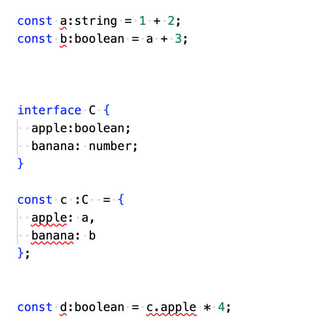
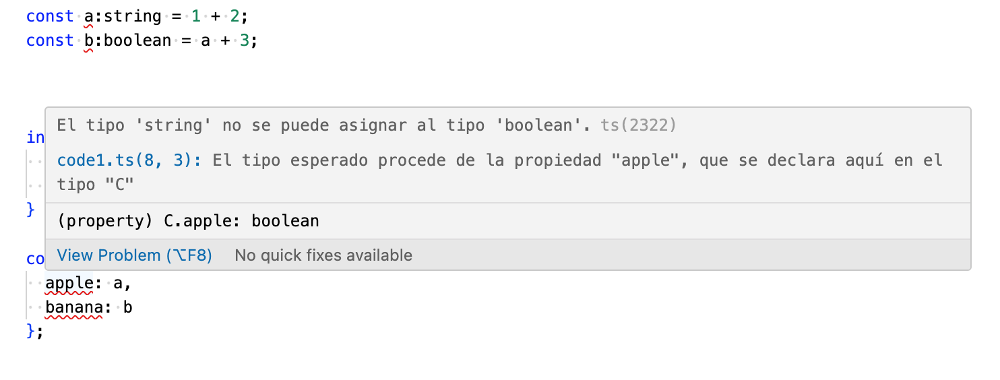

## Ejercicio 2. Respuestas de teoría. 

**Archivo code1.ts** 
Hemos modificado los tipos de todas las variables para que muestren en el error. Como vemos, debajo de cada variable aparecee un subrayado rojo indicando que el tipo asignado no se corresponde con el introducido. Así, para la variable a, que es de tipo numérico, la hemos establecido manualmente como cadena. Para b y d, les hemos asignado manualmente el tipo booleano, por lo que ahora también dan error. Para la variable c hemos creado una interfaz y asignado tipos a cada propiedad, por lo que ahora las propiedades de la variable c también dan error. 
En la imagen 1 vemos todo el código resaltado y en la imagen 2 vemos un ejemplo del error respecto de la propiedad apple. 

**1. (1 punto) Para cada uno de los valores del fichero code2.ts, ¿Qué tipo de datos inferirá TypeScript? Explica por qué se ha inferido este tipo de dato.**
Para la constante a inferirá un tipo numérico, porque tiene asignado un valor numérico. 
Para las constantes b y c inferirá un tipo cadena, porque las dos cosntantes tienen asignada una cadena de texto envuela entre comillas. 
Para la variable d iferirá un array que, a su vez, está compuesto de valores booleanos. Por esto, si quisiéramos añadir una cadena o número al array (por ejemplo, con un push), nos daría error (aunque también no daría error porque no podemos interferir con una cost). 
La constante e es un objeto con una propiedad de tipo cadena. 
La constante f también es un array. En este caso, contiene tanto un número como un booleano, por lo que inferirá los dos tipos para el array.
La constante g es, como f y d, un array. En este caso al contener únicamente valores numéricos, inferirá numérico. 
Por último, la constante h  tiene asignado null, por lo que es el tipo que le corresponde también.

**2. (1 punto) ¿Por qué se dispara cada uno de los errores del fichero code3.ts?**
***i = 4; // Error TS2588 : Cannot assign to 'i' because it is a constant.ts(2588)***
i esstá establecida como constante, lo que quiere decir que no puede modificarse, al contrario de lo que pasa con let. Como hemos declarado i con anterioridad y le hemos asignado el valor 3, ahora no podemos cambiárselo a 4. 

***j.push('5'); // Error TS2345: Argument of type '"5"' is not assignable to parameter of type 'number'.***
El array j está compuesto por números, por lo que, al intentar insertar en él la cadena '5', nos salta este error. Por mucho que 5 sea un número, al envolverlo en comillas, lo trataremos siempre como cadena. 

***let k: never = 4; // Error TSTS2322: Type '4' is not assignable to type 'never'.***
never se utiliza para representar situaciones donde una función nunca retorna (por ejemplo, una función que arroja una excepción o entra en un bucle infinito), o para indicar variables que no pueden tener un valor. Es por esto que no podemos asignarle ningún valor a k. 

***let m = l * 2; // Error TS2571: Object is of type 'unknown'.***
Este error ocurre porque l está declarada como variable desconocida, por lo que antes de poder hacer la operación se debe determinar la variable l. 

**3. (0.5 puntos) ¿Cuál es la diferencia entre una clase y una interface en TypeScript?**
La diferencia entre una clase y una interface es que una es la definición de la otra. Usaremos la interfaz para determinar cada una de las propiedades y los tipos de una clase y más tarde declararemos la clase con base en la estructura que hemos desarrollado en la interfaz. 
En el ejemplo de la figura 1 lo podemos ver: primero determinamos la interfaz C con una estructura y tipos determinados. Luego le decimos que la variable c sigue el modelo de la interfaz C y, por último, asignamos valores a cada una de las propiedades de la clase según los tipos que hemos determinado. En el ejemplo de la figura 1 no ocurre así porque deliberadamente hemos asignado tipos distintos para forzar el error. 

